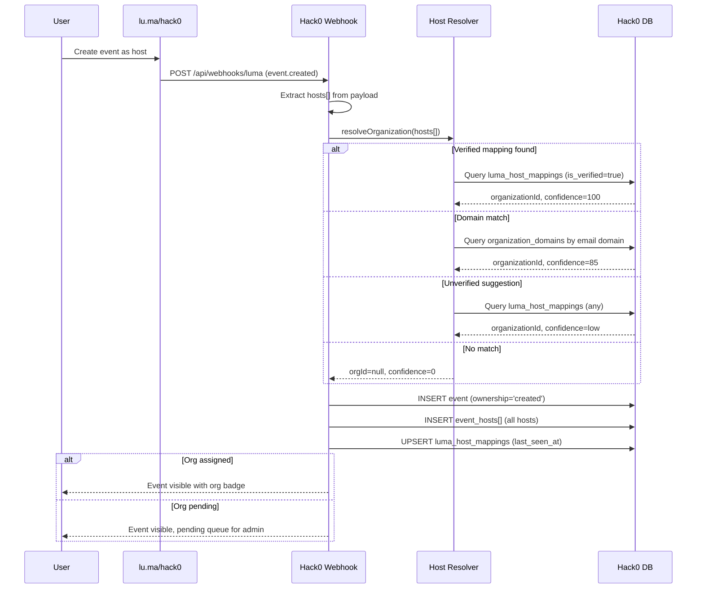
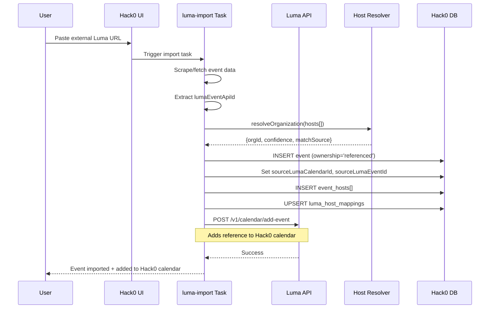
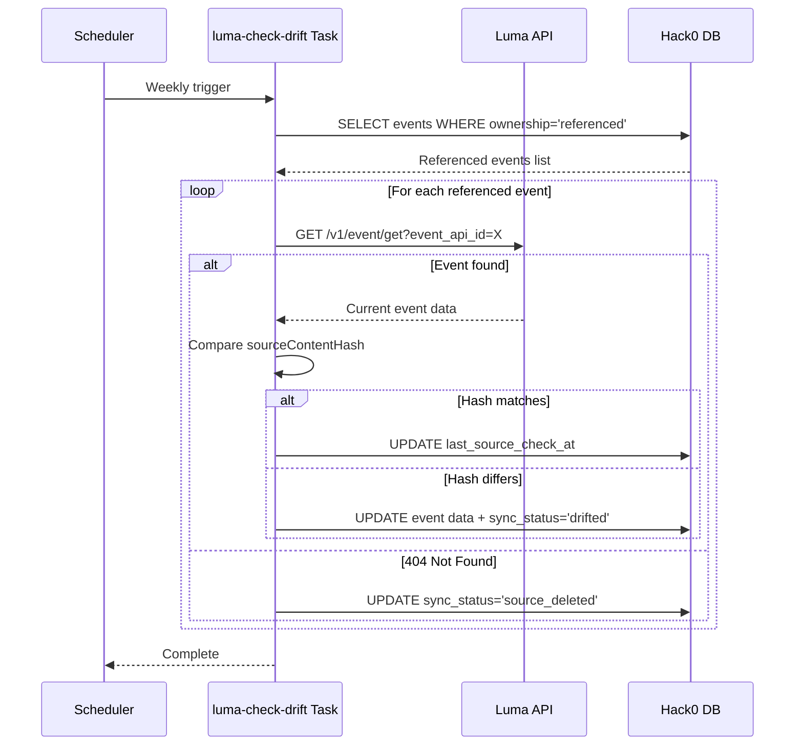
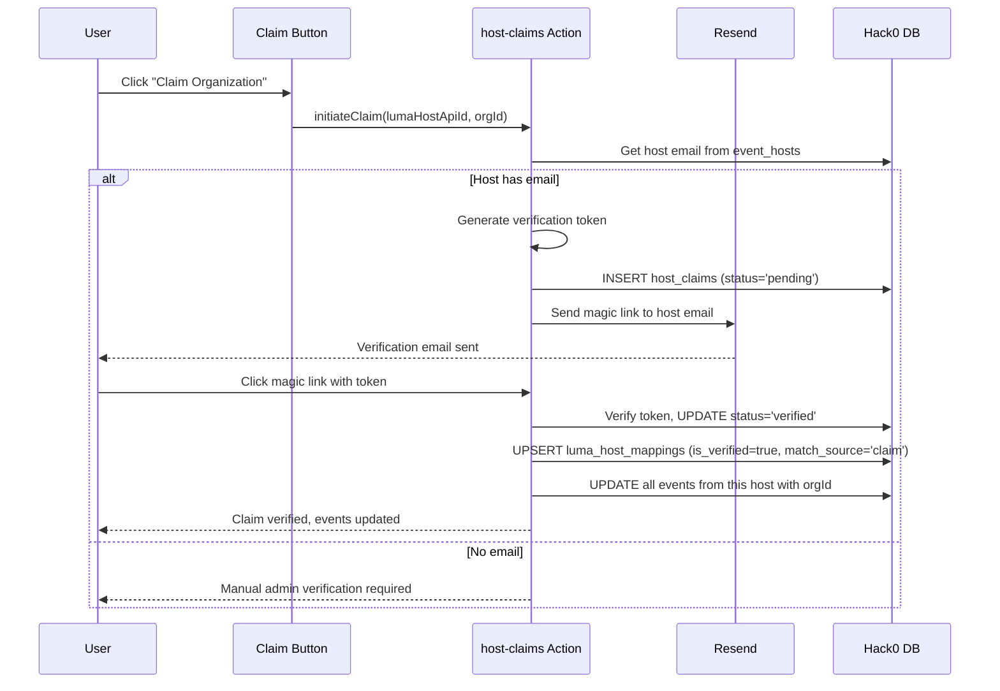

# Luma Integration

## How It Works

Hack0 has a single Luma calendar (`lu.ma/hack0`) with a Plus subscription ($60/mo). This calendar acts as an aggregator for all LATAM tech events.

Events can enter Hack0 in two ways:

1. **Created directly** on lu.ma/hack0 → Hack0 owns these events and can update them
2. **Imported via URL** → Hack0 creates a reference (like a bookmark) to the external event

The tricky part is figuring out which organization each event belongs to. Since Luma events can have multiple hosts, we use a smart resolution system to match events to the right community.

---

## The Two Paths

### Path A: Someone creates an event on lu.ma/hack0



**What happens:**
1. Someone creates an event on the hack0 Luma calendar
2. Luma sends a webhook to Hack0
3. We look at ALL the hosts (not just the first one) and try to match them to an organization
4. If we find a match, the event gets assigned to that org
5. If not, it goes to a pending queue for manual review

---

### Path B: Someone imports an external Luma event



**What happens:**
1. User pastes a Luma URL (like `lu.ma/gdg-lima-meetup`)
2. We scrape the event data
3. Try to match hosts to organizations
4. Save the event as "referenced" (we don't own it, just indexing it)
5. Call Luma's add-event API to bookmark it in the hack0 calendar

---

## How We Match Hosts to Organizations

When an event has multiple hosts, we check them in this order:

| Priority | Method | Confidence | Example |
|----------|--------|------------|---------|
| 1 | Verified manual mapping | 100% | Admin manually linked "GDG Lima" host to GDG Lima org |
| 2 | Email domain match | 85% | Host email `@gdglima.org` matches org domain |
| 3 | Previous unverified match | Varies | We saw this host before and guessed |
| 4 | No match | 0% | Goes to pending queue |

This is deterministic - we always check ALL hosts, not just the first one.

---

## Keeping Events Up to Date

### For referenced events: Drift Detection

External events can change. Every week, we check if they've been updated:



**Possible states:**
- `synced` - Event matches the source
- `drifted` - Source changed, we updated our copy
- `source_deleted` - Original event was deleted

---

## Self-Service: Claiming Your Organization

If an event has the wrong org (or no org), communities can claim it:



**How it works:**
1. User clicks "Claim Organization" on an event
2. We send a verification email to the host's email
3. They click the magic link
4. All their events get assigned to their org
5. Future events from that host auto-match

---

## Background Jobs

| Job | When | What it does |
|-----|------|--------------|
| `luma-scheduled-sync` | Every 6 hours | Syncs new events from lu.ma/hack0 |
| `luma-backfill-orgs` | Sundays 3am | Re-tries matching for events with no org |
| `luma-check-drift` | Sundays 4am | Checks if referenced events changed |

---

## Setup

You need these environment variables:

```bash
# Your Luma API key (from the hack0 calendar with Plus subscription)
LUMA_API_KEY=luma_xxxxx

# The calendar API ID (to know which events we "own")
HACK0_LUMA_CALENDAR_API_ID=cal_xxxxx
```

---

## Quick Reference

| Term | Meaning |
|------|---------|
| **Created event** | Event made on lu.ma/hack0 - we own it |
| **Referenced event** | External event we imported - read-only |
| **Host** | Person/org that created the Luma event |
| **Confidence** | How sure we are about the org match (0-100) |
| **Drift** | When an external event changes after we imported it |
