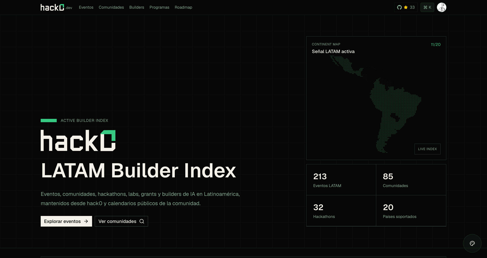
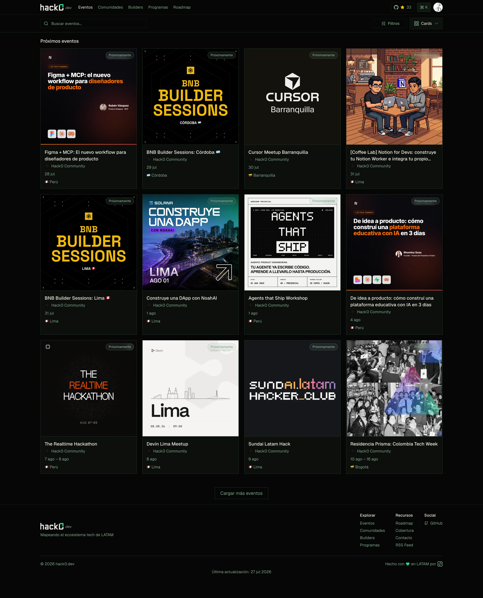
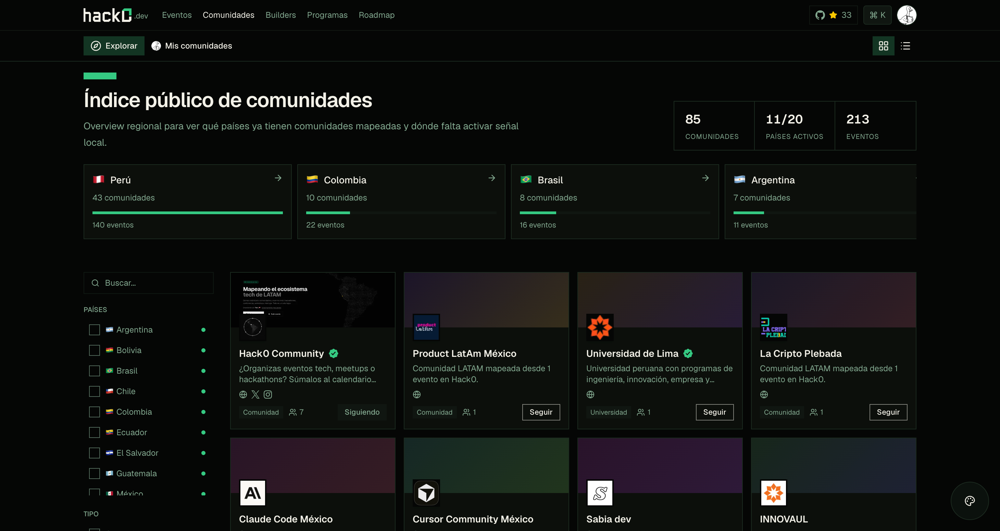
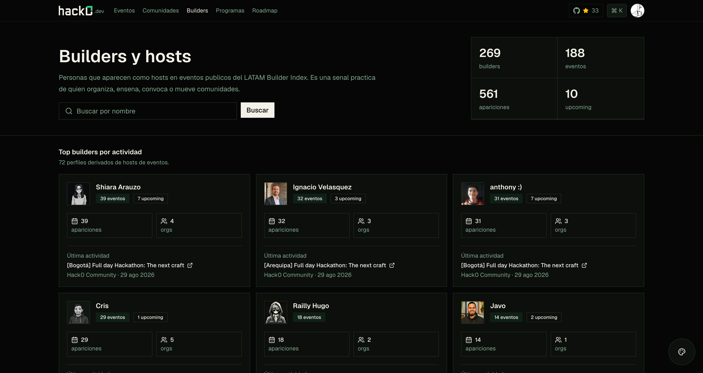
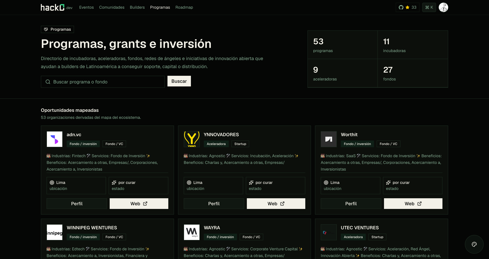

<pre>
╔══════════════════════════════════════════════╗

  ██╗  ██╗ █████╗  ██████╗██╗  ██╗ ██████╗
  ██║  ██║██╔══██╗██╔════╝██║ ██╔╝██╔═████╗
  ███████║███████║██║     █████╔╝ ██║██╔██║
  ██╔══██║██╔══██║██║     ██╔═██╗ ████╔╝██║
  ██║  ██║██║  ██║╚██████╗██║  ██╗╚██████╔╝
  ╚═╝  ╚═╝╚═╝  ╚═╝ ╚═════╝╚═╝  ╚═╝ ╚═════╝

  LATAM BUILDER INDEX  ·  always fresh  ·  open
  events · communities · builders · programs

╚══════════════════════════════════════════════╝
</pre>

### LATAM Builder Index

**The public, always-fresh map of the Latin American builder ecosystem** — events, hackathons, communities, labs, grants, and the people building.

## What is hack0?

hack0.dev maps **who's building in Latin America and what's happening** — in one public index, kept fresh automatically from community calendars (Luma) and the web. No more scattered event links: the LATAM builder signal, in one place.

- **Events** — every tech event, hackathon and meetup across LATAM, auto-detected and filterable.
- **Communities** — the public directory of communities, universities and labs, country by country.
- **Builders & hosts** — the people who organize, teach, convene and move communities: a practical signal of who's active.
- **Programs** — incubators, accelerators, funds and grants that help LATAM builders find support and capital.

### [Events →](https://hack0.dev/events)
Auto-detected and curated, always current.

### [Communities →](https://hack0.dev/c)
Regional coverage — which countries already have mapped communities, and where signal is still missing.

### [Builders & hosts →](https://hack0.dev/builders)
Profiles derived from event hosts — who's building, teaching and convening across the region.

### [Programs, grants & investment →](https://hack0.dev/opportunities)
Incubators, accelerators, funds and angel networks that help builders find support, capital or distribution.

## Roadmap & where it's going

Today hack0 is the **public index** above. Next, it becomes a toolkit for the community managers who feed it:

- **Frictionless publishing** — drop a Luma link and your events land in the index with more exposure.
- **Per-event design kit** — auto-generated badges, certificates and shareable graphics built from your event's own style, so organizers spend less time on design and grow their reach.
- **Wider coverage** — country by country, until all of LATAM has active signal.

Live roadmap → **[hack0.dev/roadmap](https://hack0.dev/roadmap)**.

## Contributing

hack0 grows with the community — you don't need to touch code to help:

- **Add your community or events** — [publish on hack0.dev](https://hack0.dev) or connect your Luma calendar; public events flow into the index.
- **Improve the coverage** — spot a missing event, community, lab or program in your country? Flag it.
- **Build with us** — for code contributions, see the [Contributing Guidelines](CONTRIBUTING.md).

If you're building in LATAM, a ⭐ helps more people find the index.

Made with 💚 in LATAM · [hack0.dev](https://hack0.dev)

